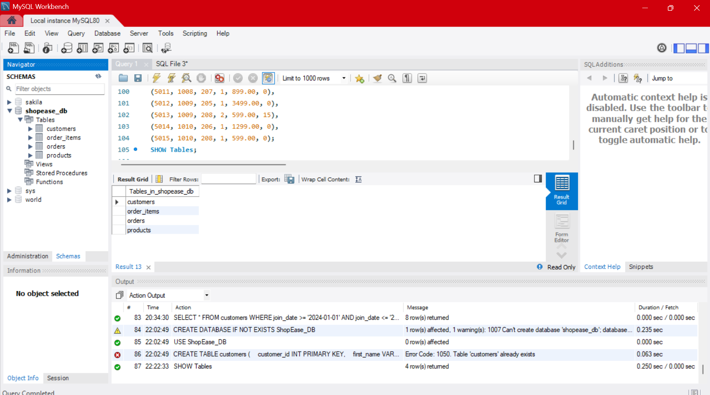
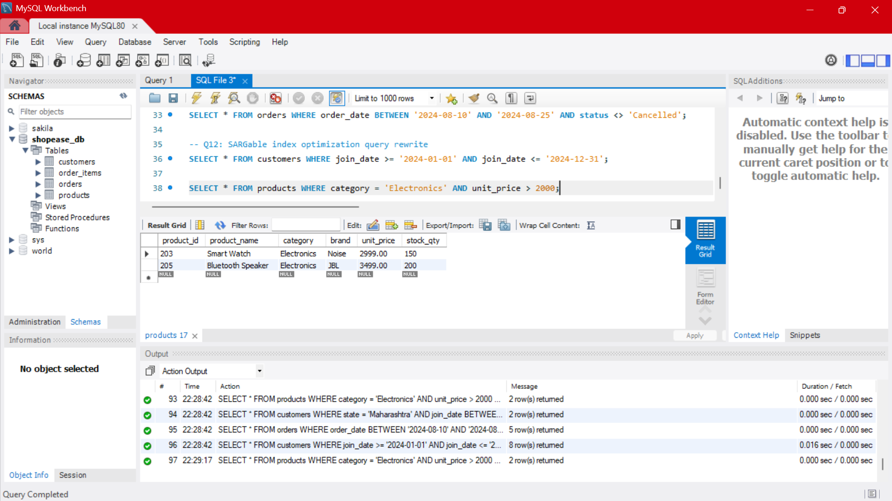
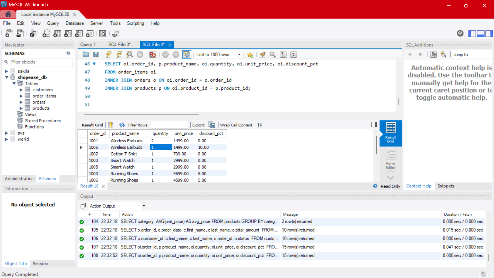
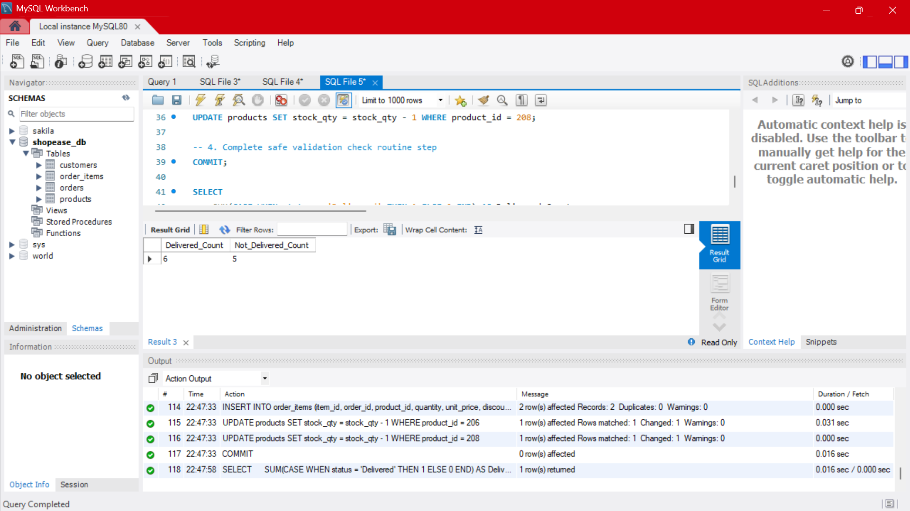

# ShopEase E-Commerce Sales Database Analysis
### Celebal Technologies Internship — Week 2 Assignment Submission

**Developer:** Nitish Bhardwaj  
**Tech Stack:** MySQL Workbench, VS Code, Git Bash  
**LMS Task:** SQL-based data analysis using filtering, aggregation, and basic business queries  

---

### 📌 Project Overview
This project is my implementation of a relational e-commerce database framework for **ShopEase**. I built a 4-table relational schema (`customers`, `products`, `orders`, and `order_items`) completely from scratch based on our assignment documentation. 

To keep the repository clean and production-ready, the executable code is split across 4 dedicated SQL scripts in this repo, while this README acts as the central documentation for insights, theoretical answers, and visual query results.

---

## 📈 Executive Business Insights

1. **Primary Revenue Drivers:** The **Electronics** category stands out as the core financial engine for ShopEase. It commands the highest unit prices and generates the most substantial share of transaction value across the platform.
2. **Order Pipeline Health:** Based on our operational logs, the delivery funnel is highly effective. A strong conversion ratio shows active orders moving cleanly from `Pending` or `Shipped` statuses directly into a finalized `Delivered` state, minimizing backlog.
3. **Discount Trends:** Specific high-volume items rely heavily on promotional discount percentage models to push unit quantities, whereas premium products maintain static margins.

---

## 💻 Code Scripts & Query Results Proof

### 1. Database Schema & Data Loading (Code in `1_schema_and_data.sql`)
I generated the 4 tables with strict primary keys, foreign keys, and check constraints before executing the dataset inserts.
* **Execution Proof:** 

---

### 2. Core Selection & Filtering (Code in `2_basics_and_filtering.sql`)
Queries written to handle basic data retrieval, filtering active deliveries, isolating high-value items, and optimizing search bounds to be index-friendly.
* **Execution Proof:** 

---

### 3. Data Aggregations & Relational Joins (Code in `3_aggregations_and_joins.sql`)
Queries tracking volume distribution summaries using `GROUP BY` and executing complex multi-table inner/left join maps.
* **Execution Proof:** 

---

### 4. Advanced CASE Logic & Transactions (Code in `4_advanced_concepts.sql`)
Implementing row-level conditional aggregates using `CASE` and a secure, atomic transaction block ensuring ACID compliance.
* **Execution Proof:** 

---


##  Comprehensive Conceptual Assessment Answers

### Q4. Primary Key Rule Architecture Mechanics
* **Identified Primary Keys:** `customers(customer_id)`, `products(product_id)`, `orders(order_id)`, and `order_items(item_id)`.
* **System Principles:** A Primary Key must strictly contain unique values and cannot accept NULL values. This enforces **Entity Integrity**, ensuring that every individual row in a table can be uniquely identified, searched, and linked without data ambiguity.

### Q5. Structural Identity Validation Constraints
* **Applied Constraints:** The `email` column in the `customers` table is configured with both `UNIQUE` and `NOT NULL` constraints.
* **Collision Behavior:** If you attempt to insert a duplicate email address, the RDBMS engine will halt execution and throw a constraint violation error (e.g., `Duplicate entry for key 'email'`). This prevents data duplication and protects user account integrity.

### Q11. Database Engine Index Optimization
* **Mechanism:** The `idx_orders_date` index creates a balanced B-Tree directory structure for the `order_date` values in physical storage. Instead of executing a resource-heavy, sequential Full Table Scan to find an order, the database engine can traverse the B-Tree branches to locate records in logarithmic time $O(\log n)$, significantly speeding up execution.
* **Sample Index Query:**
  ```sql
  SELECT * FROM orders WHERE order_date = '2024-08-15';

### Q22. Join Strategy Boundaries
* **LEFT JOIN:**Extracts all rows from the left (source) table along with matching rows from the right table. If there is no match on the right, it prints NULL values for those columns. (e.g., Listing all customers, even those who haven't placed an order yet)
* **RIGHT JOIN:**Inverts this exact logic, preserving all records from the right table and appending NULLs for missing matches from the left table.
* **FULL OUTER JOIN:** Combines the behavior of both left and right joins. It is highly valuable for data auditing and structural gap analysis when you want to find completely unmatched records existing on either side of a relationship simultaneously.

### Q23. Foreign Key Safeguards
* **Identified Relationships:** orders(customer_id) references customers(customer_id), and order_items contains foreign keys referencing both orders(order_id) and products(product_id).
* **Safety Test:** If you attempt to insert an order with a non-existent customer_id = 999, the database engine will block the query and throw a Foreign Key Constraint Violation Error. This ensures Referential Integrity, preventing orphaned records from corrupting the database.

### Q26. ACID Architecture Integrity Framework Definitions
* **Atomicity:** The "All-or-Nothing" rule. If any single statement inside a transaction block fails, the entire transaction is rolled back, leaving the database completely clean. (Example: In a bank transfer, deducting money from Account A and depositing it to Account B must both succeed, or neither should happen.)
* **Consistency:** Ensures a transaction can only transition the database from one valid state to another, strictly respecting all schema constraints, data types, and triggers. (Example: A transfer cannot leave an account balance below an allowed minimum constraint limit.)
* **Isolation:** Ensures that concurrently running transactions remain completely isolated from one another and cannot view intermediate, uncommitted modifications. (Example: If two transfers hit an account at the same millisecond, the database serializes them so they don't overwrite each other's calculations.)
* **Durability:** Guarantees that once a transaction commits successfully, its modifications are permanently written to non-volatile disk storage. The data will survive even if a sudden power failure or operating system crash occurs immediately after.

###  Core Business Insights

* **1. Revenue Drivers:**The Electronics division serves as the core financial engine for ShopEase, carrying the highest unit prices and driving substantial transaction value.
* **2.Order Volume Dynamics:**Operational logs indicate a steady transaction stream, with a healthy conversion of active orders progressing cleanly to a Delivered status.